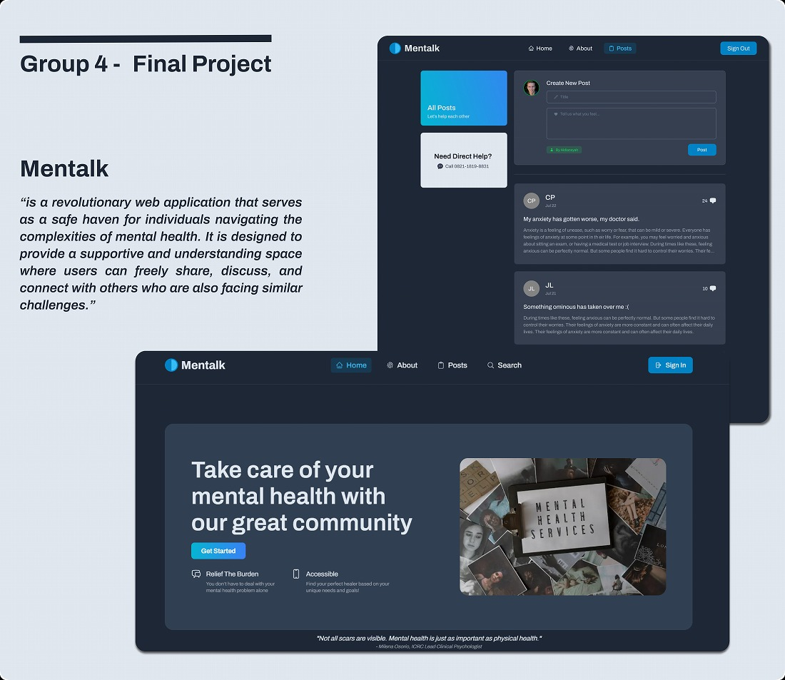
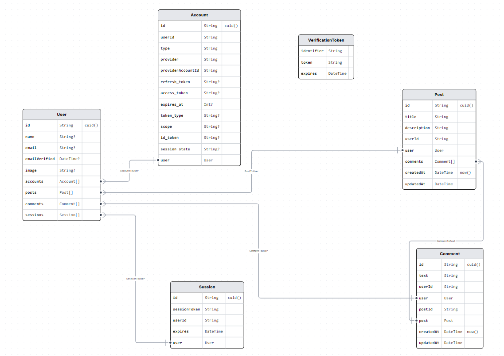

# Mentalk

### Background of the App

“We are a group of people who really care about the general masses’ mental health and decided to make a platform on which they could ease their pain by sharing with others.”

## Data Model

## Links

- Website: [Mentalk](http://mentalk.id/)
- Figma: [Mentalk](https://www.figma.com/file/ZqahtRaw86FJ61bpxsiHRg/Group-4?type=design&node-id=10-118&mode=design&t=5klCUt8fEIPjKVkW-0)
- GitHub: [Mentalk](https://github.com/revou-fsse-1/w24-group-final-group-4)

## Contributors

---

| Name                 | Role               |
| -------------------- | ------------------ |
| Aldiansyah Dwi Putra | Lead Engineer      |
| Anggih Pratama       | Front-end Engineer |
| Rio Yulinanda K      | Front-end Engineer |
| Winona Ivana         | Back-end Engineer  |

## Technologies

